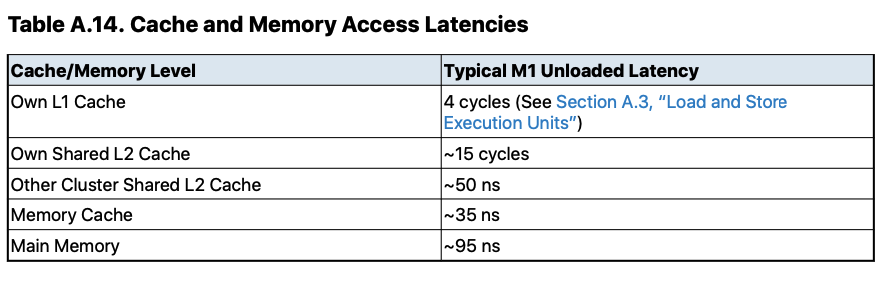
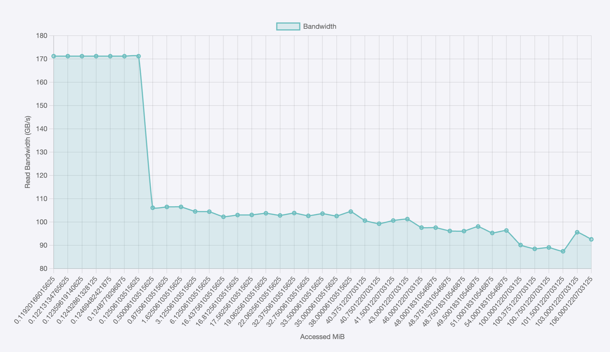

My homework assignment for performance awareness programming
## 11/11/2024

### trashing the L1 cache
Today's homework involves designing a program to trash the L1 data cache by creating a memory access
pattern that repeatedly evicts the same L1 cache line, thereby continuously triggering L1 cache misses.

For apple M3, it has a 128KiB, 8 way, 64B line L1 cache. 
since it's an 8 way cache, it should have `((128*1024)/64)/8 = 256` sets, with 8 cache lines per sets.
it needs 8 bits to address 256 sets, 3 bits to address 8 ways, and 6 bits to address into a 64B cache line.
This means it needs `8 + 3 + 6 = 17` bottom bits to index into a specific cache line in L1 (with 8 bits to locate the set and 3 bits to locate the way)

Therefore, if we load a specific address and its value is cached in L1, adding a `2^17 = 128K` offset to the address will keep the bottom 17 bits unchanged. This means the content at the new address will be brought into the same L1 entry as the previous address when accessed.

Based on the above analysis, we can first allocate 1MB of memory and load back and forth between the base address `x` and `x+128k`. Normally, reading 2 cache lines would only occupy 2 out of the 256*8 L1 cache slots, and the throughput should match that of an L1 cache hit. However, since these 2 lines coincide in the same L1 cache slot, they will evict each other, causing repeated cache misses.

we can construct an array of `distance` which consists of how many bytes to offset away from base address.
`u64 distance[] = {2, 65, 128*KiByte, 128*KiByte+64};`

- distance 2 causes loading from base address x and x+2 repeatedly, since these 2 addresses reside on the same cache line, loading from both should achieve maximum L1 cache throughput.
- distance 65 offsets `x` to the next cache line, it's almost impossible to trigger any cache miss.
- distance 128k, like the analysis above, during reading back and forth between `x` and `x+128k` should trigger reapted L1 cache misses.
- distance 128k+64, by offseting 1 cache line away from the previous distance, its throughput should get back to the level of an L1 cahce hit again.

```
distance: 2, BW: 56.56 GB/s
distance: 65, BW: 56.57 GB/s
distance: 131072, BW: 49.48 GB/s
distance: 131136, BW: 56.58 GB/s
```
As the restults shown above, at distance 128K, its throughput did take a hit by around 12.5%.

### cache test revisit
Following the "Cache Sets and Indexing" lesson, I think I'd better reporoduce what Casey's implementation on unaligned read, targeting both offset and cache levels. Previously, what I did was effectively testing unaligned read across 1GB memory region. This time however, I'll design the code so that it can test on both L1, L2, L3 as well as memory.

The new implementation located at `cache_test.cpp`
```
Region(Byte), Offset, Throughput
8256, 0, 171
8256, 1, 171
8256, 2, 171
8256, 3, 171
8256, 15, 171
8256, 16, 171
8256, 17, 171
8256, 31, 171
8256, 32, 171
8256, 33, 171
8256, 63, 171
8256, 64, 171
8256, 65, 171
2097216, 0, 106
2097216, 1, 101
2097216, 2, 102
2097216, 3, 101
2097216, 15, 101
2097216, 16, 106
2097216, 17, 101
2097216, 31, 101
2097216, 32, 106
2097216, 33, 101
2097216, 63, 101
2097216, 64, 106
2097216, 65, 101
10485792, 0, 104
10485792, 1, 99
10485792, 2, 100
10485792, 3, 99
10485792, 15, 99
10485792, 16, 104
10485792, 17, 99
10485792, 31, 99
10485792, 32, 104
10485792, 33, 99
10485792, 63, 99
10485792, 64, 104
10485792, 65, 99
1073741856, 0, 86
1073741856, 1, 82
1073741856, 2, 83
1073741856, 3, 81
1073741856, 15, 81
1073741856, 16, 84
1073741856, 17, 81
1073741856, 31, 81
1073741856, 32, 82
1073741856, 33, 80
1073741856, 63, 82
1073741856, 64, 82
1073741856, 65, 81
```

- As seen above, it seems that unaligned read has **no** effect on L1 cache read.
- on the other hand, for L2, L3 cache access, unaligned read has 5% panelty.
- in L2, L3 read, whenever the read is **16 byte** aligned, it achieves the best throughput.
- unaligned read observed no obvious effect on large read

## 10/11/2024
Designed an experiment to test how does unaligned memory read affect the bandwidth.
### Aligned Allocate
First we need a function to allocate a memory region that its starting address is aligned at specific number, for example,
64B, that means, the base pointer returned by such a function should awlays be multiple of 64.

Normally, such a function is implemented in the following steps:
1. malloc a block of memory that is at least 64B + sizeof(void*) get the pointer as `base`
2. find the next 64B aligned address `ptr` ahead of `base` such that there is big enough space between `base` and `ptr` that can hold an additional pointer `(base + 64-1 + sizeof(void*)) & ~(64-1)`
3. store the `base` at that additional pointer `*(ptr - sizeof(void*)) = base`
4. return the `ptr` as the starting address
5. when deallocating, restore `base` from `ptr`, then free it as usual.


### effect of unaligned read
Constructing 2 assembly which are almost identical, except that the second one has an offset on its base pointer.

both functions read 64B (a cache line) per iteration, the `UnAligned_Read` has an arbitrary offset added on the base pointer
```c
//x0, count
//x1, base pointer
_Align_Read:
1:
    ldr q0, [x1, #0]
    ldr q0, [x1, #16]
    ldr q0, [x1, #32]
    ldr q0, [x1, #48]

    add x1, x1, #64
    subs x0, x0, #64
    bgt 1b
    ret

_UnAlign_Read:
add x1, x1, #60
1:
    ldr q0, [x1, #0]
    ldr q0, [x1, #16]
    ldr q0, [x1, #32]
    ldr q0, [x1, #48]

    add x1, x1, #64
    subs x0, x0, #64
    bgt 1b
    ret
```
The experiement showed that the unaligned version has a 2%-3% of bandwidth degradation compared to its aligned counterpart.

## 9/11/2024





Cache sizes:
- L1 Cache:
Performance Cores: 192 KB instruction cache + 128 KB data cache per core (total of 12 performance cores).
Efficiency Cores: 128 KB instruction cache + 64 KB data cache per core (total of 4 efficiency cores) 23.
- L2 Cache:
Performance Cores: 32 MB shared L2 cache per cluster (with two clusters of performance cores).
Efficiency Cores: 4 MB L2 cache per cluster 13.
- L3 Cache:
The M3 Max is estimated to have a shared last-level cache (LLC) of 48 MB, although Apple has not officially confirmed this size 46.

### Test design
#### single loop version
In This test we construct an assembly code that do a single loop, in which we issue a bunch of loads
but limit the access within a range by masking the offset. For example, to limit the access range within 2^N, we can use a mask of value 2^N-1, and calculate the offset by `offset & mask` then the offset will wrap around when it reachs 2^N.

To hide the overhead of branching and loop counter maintaince, we first analyze how many cycles those overhead would take. then we can pile additional loads operation such that the cycles spend on loads outweight the that of the bookkeeping. Since the CPU parallel loads and arithmetics, the total cycles spend would be the maximum of all parallel works, thus we can hide the cost of bookkeeping by issuing excessive loads.

In the code below, the longest dependency chain I can think of is those that involves `x3`
It might take at least 3 cycles in a loop. Since M3 Max has 3 load ports, that means it can afford to loads 3*3=9 loads per iteration at least. To make a little bit headroom, I added another 3 loads that make the total amount of loads to 4*3=12, which will certainly take 4 cycles to complete and will effectively hide the cost of offset updating and branch taking.
```c
_Read_mask:
mov x3, #0 //offset
mov x4, x1 //base pointer
mov x8, #0 //total
ldr x7, [x1] //mask

1:
    //read x 3, since there are 3 read ports
    //3 load, 1 cycle. To hide 3 cycles offset update, write 4 sets of ldr to make sure it at least takes 4 cycles to run
    ldr q0, [x4, #0]
    ldr q0, [x4, #16]
    ldr q0, [x4, #32]

    ldr q0, [x4, #48]
    ldr q0, [x4, #64]
    ldr q0, [x4, #80]

    ldr q0, [x4, #96]
    ldr q0, [x4, #112]
    ldr q0, [x4, #128]

    ldr q0, [x4, #144]
    ldr q0, [x4, #160]
    ldr q0, [x4, #176]

    //update offset
    //dependency chain, at least 3 cycles
    add x3, x3, #192 //cycle 1
    and x3, x3, x7  //cycle 2

    mov x4, x1
    add x4, x4, x3 //cycle 3


    add x8, x8, #192
    cmp x0, x8
    b.ne 1b
    ret
```

use above code to do a repetition test, we started by setting the range to 2^10 = 1kib (mask = 2^10-1), then gradually increased the mask by power of 2 (BTW, that's how the mask works, we can only do power of 2 granularity). The result is shown as below.


we can discern clearly from the graph that where's the boundary of the L1 cache (around 128KiB)
and can kind of tell where's the L2 cache which around 30Mib, but L3 cache is not visible because of the granulariy.

#### double loop version
To address the granularity issue we encountered in single loop test we can use a double loop design. In the single loop design, it loads 192 bytes per iteration, we can design a test that has arbitrary granularities as long as its multiple of 192.

For example, we choose the granularity of k*192, then we can chop 1GB into k*192 chunks, in the outer loop, we iterate 1GB/(k*192) times (that will make the total amount of read to 1GB), in the inner loop, we iterate k times.

using the double loop version we have more freedom to choose the granularity and ranges,
so I hand picked some ranges did some tests.




To my surprise, the bandwidth difference between the L2 and L3 is not that significant. We don't see dramatic falloffs at 32Mib (L2 cache size) and 48Mib (L3 cache size) as anticipated.

## 2/11/2024
### ARM64 SIMD (NEON)
There are 32 128bits vector registers.

In assembly language, vector registers are specified as `V<register number>.<number of elements><element size letter>`

◦ Byte (8b)
◦ Halfword (16b)
◦ Word (32b)
◦ Doubleword (64b)


load scalar to vector register: `LDUR <St>, [<Xn|SP>{, #<simm>}]` (a-profile architecture reference manual, page 3062)

### More throughput from SIMD
In previous experiment we know that there are 3 read ports and 2 write prots on apple M3 MAX, which means at max it can only execute 3 memory reads per cycle. The max data throughput then can be derived: `3 * 8B register = 24B/cycle`. since the CPU is only capable of taking 3 reads simultaneously, to further increase the throughput, it must increase the volumn of individual read, that's the concept of SIMD (single instruction multiple data).

SIMD instructions for ARM64 is called NEON, unlike X64's AVX which support up to 512 bit, NEON however, top out at 128 bit SIMD. There are some ARM chips support a wider SIMD called SVE, but apple M series do not.

we can swap the "normal" read/write instruction from previous experiment with SIMD one to test how does the SIMD improve the throughput.

NEON has much less freedom then regular instructions, especially on the choice of operand and immediate offset.
I managed to write a variety of tests for instruction combinations relatively comprehensively:
- `Read_4x1_ldur`: use 1 `ldur` SIMD instruction to load a 4 bytes scalar to a vector register from memory.
- `Read_4x1_ldr` : use 1 `ldr` instruction to load 4 bytes to a general purpose register from memory.
- `Read_4x2_ldur`: use 2 `ldur` SIMD instructions, each loading a 4 bytes scalar to a vector register from memory.
- `Read_4x2_ldr`: use 2 `ldr` instructions, each loading 4 bytes to a general purpose from memory.
- `Read_4x3_ldur`: use 3 `ldur` SIMD instructions, each loading a 4 bytes scalar to a vector register from memory.
- `Read_4x3_ldr`: use 3 `ldr` instructions, each loading 4 bytes to a general purpose from memory.
- `Read_4x4_ldur`: use 4 `ldur` SIMD instructions, each loading a 4 bytes scalar to a vector register from memory.
- `Read_4x4_ldr`: use 4 `ldr` instructions, each loading 4 bytes to a general purpose from memory.
- `Read_8x3_ldr`: use 3 `ldr` instructions, each loading 8 bytes to a general purpose from memory.
- `Read_8x3_ld1`: use 3 `ld1` SIMD instructions, each loading 8 bytes to a vector register from memory.
- `Read_16x3`: use 3 `ld1` SIMD instructions, each loading 16 bytes to a vector register from memory.
- `Read_16x4x1`: use 1 `ld1` SIMD instructions with 4 destination vector registers, loading 4*16 bytes to 4 vector registers
- `Read_16x4x2`: use 2 `ld1` SIMD instructions with 4 destination vector registers, each loading 4*16 bytes to 4 vector registers, each iteration loading 4*16*2 bytes in total.
- `Read_16x4x3`: use 3 `ld1` SIMD instructions with 4 destination vector registers, each loading 4*16 bytes to 4 vector registers, each iteration loading 4*16*3 bytes in total.

```
CPU Freq: 3461826780, FileSize: 1071269247

--- Read_4x1_ldur ---

Min: 267887035 (77.383142ms) 12.892953GB/s PF: 0 (0.00 faults/second)
Max: 271085835 (78.307163ms) 12.740817GB/s PF: 0 (0.00 faults/second)
Avg: 268166365 (77.463831ms) 12.879524GB/s PF: 0 (0.00 faults/second)

--- Read_4x1_ldr ---

Min: 267867954 (77.377631ms) 12.893872GB/s PF: 0 (0.00 faults/second)
Max: 270824489 (78.231670ms) 12.753112GB/s PF: 0 (0.00 faults/second)
Avg: 268289692 (77.499456ms) 12.873603GB/s PF: 0 (0.00 faults/second)

--- Read_4x2_ldur ---

Min: 133935650 (38.689299ms) 25.787421GB/s PF: 0 (0.00 faults/second)
Max: 148690354 (42.951414ms) 23.228507GB/s PF: 0 (0.00 faults/second)
Avg: 134413714 (38.827394ms) 25.695704GB/s PF: 0 (0.00 faults/second)

--- Read_4x2_ldr ---

Min: 133935725 (38.689320ms) 25.787407GB/s PF: 0 (0.00 faults/second)
Max: 144703031 (41.799616ms) 23.868574GB/s PF: 0 (0.00 faults/second)
Avg: 134255746 (38.781763ms) 25.725938GB/s PF: 0 (0.00 faults/second)

--- Read_4x3_ldur ---

Min: 93009538 (26.867184ms) 37.134417GB/s PF: 0 (0.00 faults/second)
Max: 94392471 (27.266665ms) 36.590365GB/s PF: 0 (0.00 faults/second)
Avg: 93259650 (26.939433ms) 37.034827GB/s PF: 0 (0.00 faults/second)

--- Read_4x3_ldr ---

Min: 93007016 (26.866456ms) 37.135424GB/s PF: 0 (0.00 faults/second)
Max: 95476428 (27.579782ms) 36.174950GB/s PF: 0 (0.00 faults/second)
Avg: 93149698 (26.907672ms) 37.078542GB/s PF: 0 (0.00 faults/second)

--- Read_4x4_ldur ---

Min: 93012389 (26.868008ms) 37.133279GB/s PF: 0 (0.00 faults/second)
Max: 103425767 (29.876066ms) 33.394531GB/s PF: 0 (0.00 faults/second)
Avg: 93144158 (26.906071ms) 37.080747GB/s PF: 0 (0.00 faults/second)

--- Read_4x4_ldr ---

Min: 93015281 (26.868843ms) 37.132125GB/s PF: 0 (0.00 faults/second)
Max: 93430484 (26.988781ms) 36.967110GB/s PF: 0 (0.00 faults/second)
Avg: 93097646 (26.892636ms) 37.099273GB/s PF: 0 (0.00 faults/second)

--- Read_8x3_ld1 ---

Min: 46503730 (13.433292ms) 74.270494GB/s PF: 0 (0.00 faults/second)
Max: 48177372 (13.916748ms) 71.690399GB/s PF: 0 (0.00 faults/second)
Avg: 46604860 (13.462505ms) 74.109332GB/s PF: 0 (0.00 faults/second)

--- Read_8x3_ldr ---

Min: 46503273 (13.433160ms) 74.271224GB/s PF: 0 (0.00 faults/second)
Max: 47132369 (13.614884ms) 73.279894GB/s PF: 0 (0.00 faults/second)
Avg: 46573099 (13.453330ms) 74.159870GB/s PF: 0 (0.00 faults/second)

--- Read_16x3 ---

Min: 23251459 (6.716529ms) 148.543582GB/s PF: 0 (0.00 faults/second)
Max: 26099378 (7.539192ms) 132.334763GB/s PF: 0 (0.00 faults/second)
Avg: 23284621 (6.726108ms) 148.332024GB/s PF: 0 (0.00 faults/second)

--- Read_16x4x1 ---

Min: 23251443 (6.716524ms) 148.543684GB/s PF: 0 (0.00 faults/second)
Max: 23468567 (6.779244ms) 147.169403GB/s PF: 0 (0.00 faults/second)
Avg: 23278073 (6.724217ms) 148.373749GB/s PF: 0 (0.00 faults/second)

--- Read_16x4x2 ---

Min: 23251451 (6.716526ms) 148.543633GB/s PF: 0 (0.00 faults/second)
Max: 25561931 (7.383943ms) 135.117140GB/s PF: 0 (0.00 faults/second)
Avg: 23282123 (6.725386ms) 148.347943GB/s PF: 0 (0.00 faults/second)

--- Read_16x4x3 ---

Min: 23251440 (6.716523ms) 148.543703GB/s PF: 0 (0.00 faults/second)
Max: 23978329 (6.926496ms) 144.040688GB/s PF: 0 (0.00 faults/second)
Avg: 23298519 (6.730123ms) 148.243545GB/s PF: 0 (0.00 faults/second)
```
Analysis:
- when loading data that no wider than 64bit, SIMD instructions show no advantage over normal instructions
- using 128bit NEON load instruction increase the throughput by 2x compares to 64bit normal load.
- the number of NEON read ports are 3, identical to that of normal read ports.
- NEON read throughput top out at 148GB/s, which is about 45bytes/cycle

## 31/10/2024
### Register renaming
To achieve instruction level parallelism, the less dependencies the better. There are cases called false-dependency which will impede CPU from executing instructions as parallel as possible even if the dependency is kind of "fake".

To elaborate, we can investigate by exmaples:
```
r1 = r2 + 1
r1 = r3
```
This pattern is identified as "write-after-write" situation, which `r1 = r3` must wait until `r1 = r2 + 1` has completed. That's because both instructions are trying to write to the same place, its a data race, so the operations need to be executed serially.

But why its "false" anyway? let's look at this example:
```
r1 = r2 + 1
r1 = r3
r4 = r1
```
just like the previous example, but added 1 instruction that read from `r1`. For perspective of r4, it doesn't really care about how many times r1 has been written to, it just cares about what's the lastest value r1 is currently holding. Another words, r4 doesn't depend on the any instructions before `r1 = r3`. If we modify the instructions into:
```
r1 = r2 + 1
rx = r3
r4 = rx
```
then the last 2 instructions were no longer depending on r1, which means that CPU can now execute them concurrently.
Wait but what about r1? we still need r1 been updated to r3 right? 

Here comes the register renaming and RAT (Register Aliasing Table). Modern CPUs not only virtualize memroy but also virtualize registers! In fact, CPUs nowadays have hundreds of registers (register file), but because it needs to maintain a reasonable instruction size, ISA only expose certain numbers of them. CPU then uses RAT to keep track of which register name corresponds to which slot in register file. Whenever an instruction write to a destination, CPU assigns a new slot in register file for that destination and updates RAT so that, for example, making r1 points to slot 5:
```
r1 = r2 + 1 //write slot 1, RAT: r1->slot1
r1 = r3 //write slot 5, RAT: r1->slot5
r4 = r1 //read slot 5
```
In this way, write-after-write will no longer incurs data race, thus part of dependency is eliminated.

There is another false dependency called write-after-read
```
r1 = r2
r2 = r3 + 1
```
The rationale behind why register renaming can solve it is the same.

### Probing read & write ports
Now we are at the back end of CPU, schedular now has numerous miro-ops wating to be dispatched. However, CPU has limited execution resources. The channels through which the schedular dispatches uops are called **ports**. Today we'll explore two one them: read and write ports, to estimate how many ports my CPU has.

Based on the repetition test we've been using all along, we construct a series of assembly loops where we gradually increase the number of `mov`s per loop while maintaining a fixed total `mov`s per loop. We then measure the CPU throughput (iterations per second) for each loop, observing throughput changes as the number of `mov`s increases per iteration.

For example, there are 10 things to do in total,
- version 1, we do 1 thing at a time and do it as fast as possible, recordig the elapsed time.
- version 2, we do 2 things at a time and do it as fast as possible, recording the elapsed time.
- version 3, we do 3 things at a time and do it as fast as possible, recording the elapsed time.
- version 4, we do 4 things at a time and do it as fast as possible, recording the elapsed time.
At last, we calculate each version's throughput by `10/elapsed_time`. In this way, we hope to find out what's the highest level of concurrency the CPU support for specific operation and that may be the number of specific `ports` the CPU has.

The assembly (ARM64) looks like below:
```c
_Read_x1:
1:
    ldr x3, [x1]
    subs x0, x0, #0x1
    bgt 1b
    ret

_Read_x2:
1:
    ldr x3, [x1]
    ldr x3, [x1]
    subs x0, x0, #0x2
    bgt 1b
    ret
```

Experiment results for **read**
```
CPU Freq: 4008128450, FileSize: 1071269247

--- Read_x1 ---

Min: 1072071190 (267.474260ms) 3.730068GB/s PF: 0 (0.00 faults/second)
Max: 1073628550 (267.862810ms) 3.724658GB/s PF: 0 (0.00 faults/second)
Avg: 1072466039 (267.572772ms) 3.728695GB/s PF: 0 (0.00 faults/second)

--- Read_x2 ---

Min: 535884605 (133.699459ms) 7.462238GB/s PF: 0 (0.00 faults/second)
Max: 538351912 (134.315035ms) 7.428038GB/s PF: 0 (0.00 faults/second)
Avg: 536284871 (133.799323ms) 7.456669GB/s PF: 0 (0.00 faults/second)

--- Read_x3 ---

Min: 372163479 (92.852184ms) 10.745006GB/s PF: 0 (0.00 faults/second)
Max: 390389369 (97.399416ms) 10.243360GB/s PF: 0 (0.00 faults/second)
Avg: 372541576 (92.946516ms) 10.734100GB/s PF: 0 (0.00 faults/second)

--- Read_x4 ---

Min: 535747136 (133.665161ms) 7.464153GB/s PF: 0 (0.00 faults/second)
Max: 536890270 (133.950365ms) 7.448261GB/s PF: 0 (0.00 faults/second)
Avg: 536248228 (133.790180ms) 7.457178GB/s PF: 0 (0.00 faults/second)
```
As we can see, 
- `Read_x1` read from memory once per iteration, and has the lowest throughput, it's about 1 cycle per read.
- `Read_x2` do 2 reads per loop, its throughput is 2x that of `Read_x1`.
- `Read_x3` do 3 reads per loop, but its throughput is 3x that of `Read_x1`.
- `Read_x4` is intresting, its throughput is exactly same as `Read_x2`, weird.

It seems that M3 MAX has 3 read ports

#### updated 2/11/2024
I tested on `ldrb` as opposed to `ldr` and got very intresting results, ldrb has regression at 3 reads variant.
```
CPU Freq: 4004648690, FileSize: 1071269247

--- Read_x1 ---

Min: 1072035007 (267.697641ms) 3.726956GB/s PF: 0 (0.00 faults/second)
Max: 1083107683 (270.462597ms) 3.688855GB/s PF: 0 (0.00 faults/second)
Avg: 1072994451 (267.937224ms) 3.723623GB/s PF: 0 (0.00 faults/second)

--- Read_x2 ---

Min: 535772082 (133.787536ms) 7.457326GB/s PF: 0 (0.00 faults/second)
Max: 553037887 (138.098977ms) 7.224509GB/s PF: 0 (0.00 faults/second)
Avg: 536390394 (133.941935ms) 7.448729GB/s PF: 0 (0.00 faults/second)

--- Read_x3 ---

Min: 714590935 (178.440355ms) 5.591209GB/s PF: 0 (0.00 faults/second)
Max: 715631766 (178.700261ms) 5.583077GB/s PF: 0 (0.00 faults/second)
Avg: 714993871 (178.540972ms) 5.588058GB/s PF: 0 (0.00 faults/second)

--- Read_x4 ---

Min: 372070050 (92.909536ms) 10.738373GB/s PF: 0 (0.00 faults/second)
Max: 374967095 (93.632956ms) 10.655407GB/s PF: 0 (0.00 faults/second)
Avg: 372446858 (93.003628ms) 10.727509GB/s PF: 0 (0.00 faults/second)
```

Experiment results for **write**
```
CPU Freq: 3997487140, FileSize: 1071269247

--- Write_x1 ---

Min: 1071526276 (268.049962ms) 3.722057GB/s PF: 0 (0.00 faults/second)
Max: 1073711042 (268.596497ms) 3.714483GB/s PF: 0 (0.00 faults/second)
Avg: 1072344295 (268.254595ms) 3.719218GB/s PF: 0 (0.00 faults/second)

--- Write_x2 ---

Min: 535748083 (134.021215ms) 7.444323GB/s PF: 0 (0.00 faults/second)
Max: 555067899 (138.854205ms) 7.185214GB/s PF: 0 (0.00 faults/second)
Avg: 538054077 (134.598076ms) 7.412418GB/s PF: 0 (0.00 faults/second)

--- Write_x3 ---

Min: 535904936 (134.060453ms) 7.442144GB/s PF: 0 (0.00 faults/second)
Max: 552256361 (138.150879ms) 7.221794GB/s PF: 0 (0.00 faults/second)
Avg: 536404448 (134.185409ms) 7.435214GB/s PF: 0 (0.00 faults/second)

--- Write_x4 ---

Min: 535835402 (134.043058ms) 7.443110GB/s PF: 0 (0.00 faults/second)
Max: 539471968 (134.952771ms) 7.392936GB/s PF: 0 (0.00 faults/second)
Avg: 536294428 (134.157887ms) 7.436739GB/s PF: 0 (0.00 faults/second)
```
- It seems like we only got 2 **write ports** here.

## 30/10/2024
Upon reading the optimization guide, I noticed that the apple M series L1I cache spec is `192KiB, 6-way, 68B lines`. We know that MacOS uses 16KiB page, that means the bottom 14 bits of virtual address and physical address are the same. If L1 cache uses those 14 bits as key, within wich of 6 bits are used to index inside a cache line (64B), that left of `14-6 = 8` bits to be used as key, which means L1I cache should have `2^(14-6) = 256` entries, since its a 6-way associative cache, that means the total size of L1I cache should be `256*6*64 = 98304 = 96KiB`. That is exactly half of what's on the spec. Im not sure where does the other half come from, maybe somehow there are 512 entries? 

I also cannot find a reliable source of how to dissect M chip virtual address, the closest thing I can find is from AsahiLina's talk which is about GPU virtual addresses.


## 29/10/2024
### Apple Silicon Branch Terminology
**Target Address**: The next program counter (PC) address specified by a control flow altering instruction

**Conditional Branch**: A control flow altering instruction where the next PC is the Target Address or the current PC+4, depending on evaluation of a condition.

**Taken Branch**: An unconditional branch or a conditional branch with a TRUE condition. The PC is updated to the Target Address.

**Predicted Branch**: A branch for which the processor will make an "educated guess" as to the condition and/or target address of the branch. The processor will begin fetching instructions after fetching a branch according the prediction.The processor will check the prediction against the actual outcome when the branch executes. Generally, all branches are predicated with the exception of direct unconditional branches.

**Correctly Predicted Branch**: A predicted branch for which the actual outcome matches that of the prediciton.

**Mispredicted Branch**: A predicted branch for which the actual outcome does not match the prediction. Instructions fetched after the branch must be flushed from the machine.

### Reflection
Yesterday I was mainly reading the Apple Silicon CPU Optimization Guide and tried to get information that can explain what I observed at previous experiment, which is that the throughput across all variants of code was 1.8GB/s no matter how many nops I put into the false branch.

After watching the video and reading the optimization guide, it revealed to me the falw in my experiment. The optimization guide says **taking branch itself will cost performance**. That explains why no matter how many nops I put in, even zero nops, brought down the throughput from 3GB/s to 1.8. It's because in previous experiment, the code was written in a way that it always takes branch.

### Redesign the experiment
Here is how to properly test. Similar to what we've done before, we setup a loop, this time, we design it in a way that we can control whether the code branches or not. We can even make the code branches in a pattern we specified.
```c
_ConditionalNOP:
    mov x8, #0x0
1:
    ldrb w2, [x1, x8]
    add x8, x8, #0x1 //increment
    cmp x2, #0x1
    b.eq .skip // take the jump if data[i] == 1
    //FallthroughBranch
    nop
.skip:
    //TakenBranch
    cmp x8, x0
    b.ne 1b
    ret
```
what this function looks like in C would be `void ConditionNOP(int count, u8* data);`. Now we can provide different data to test different branching patterns.

This is the final results of experiment on my M3 mbp
```
CPU Freq: 3970940410, FileSize: 1071269247

--- ConditionalNOP Never---

Min: 1073146482 (270.249959ms) 3.691757GB/s PF: 0 (0.00 faults/second)
Max: 1121113761 (282.329535ms) 3.533804GB/s PF: 0 (0.00 faults/second)
Avg: 1076750168 (271.157473ms) 3.679402GB/s PF: 0 (0.00 faults/second)

--- ConditionalNOP Awalys---

Min: 2144715241 (540.102600ms) 1.847236GB/s PF: 0 (0.00 faults/second)
Max: 2162015070 (544.459208ms) 1.832455GB/s PF: 0 (0.00 faults/second)
Avg: 2148695099 (541.104846ms) 1.843815GB/s PF: 0 (0.00 faults/second)

--- ConditionalNOP Every 2---

Min: 2680514617 (675.032698ms) 1.477998GB/s PF: 0 (0.00 faults/second)
Max: 2738440429 (689.620127ms) 1.446735GB/s PF: 0 (0.00 faults/second)
Avg: 2687746113 (676.853802ms) 1.474022GB/s PF: 0 (0.00 faults/second)

--- ConditionalNOP Every 3---

Min: 2147513204 (540.807210ms) 1.844830GB/s PF: 0 (0.00 faults/second)
Max: 2258547012 (568.768800ms) 1.754135GB/s PF: 0 (0.00 faults/second)
Avg: 2186193773 (550.548119ms) 1.812189GB/s PF: 0 (0.00 faults/second)

--- ConditionalNOP Every 4---

Min: 1903025867 (479.238082ms) 2.081840GB/s PF: 0 (0.00 faults/second)
Max: 2690190169 (677.469287ms) 1.472683GB/s PF: 0 (0.00 faults/second)
Avg: 2241625170 (564.507381ms) 1.767377GB/s PF: 0 (0.00 faults/second)

--- ConditionalNOP RandomOS---

Min: 11360115885 (2860.812481ms) 0.348746GB/s PF: 0 (0.00 faults/second)
Max: 11412899970 (2874.105071ms) 0.347133GB/s PF: 0 (0.00 faults/second)
Avg: 11386726983 (2867.513940ms) 0.347931GB/s PF: 0 (0.00 faults/second)
```
- As we can see, took branch every time did bring throughput down to 1.8GB/s.
- The CPU handles every 2 jumps poorly, throughput downed more than 20%
- Every 3 jumps brought the throughput back to that of the Awalys jump.
- Every 4 jumps's throughput exceeds that of the Awalys jump.
- Finally, the random jumps shows worst performance, that shows how constantly mispredict incurs huge performance penalty.

we can calculate how many cycles per iteration in the worst case:
`3970940410/(0.347931*1024*1024*1024) = 10.6` that means in the worst case, 1 crank takes 10 cycles to finish. As mentioned in the video, that number roughly equals to the number of pipeline stages the CPU has. Since every iteration, when mispredict happens, the branch instruction must be at the end of pipeline, misprediction means the entire pipeline must be flushed, then CPU must spend 10 cycles to move micro-ops through the piepine, assuming CPU move 1 stage per cycle, then it shall cost it 10 cycles to fill a 10 stages pipeline.

## 27/10/2024
### Setup the assembly playground
what I gonna do is to reproduce the assembly playground on MacOS.

1. Get hands on MacOS ABI document, understand how to pass parameters using registers
2. Get a NASM counterpart for arm, use it to produce a C library that can be linked.
3. reporduce Casey's results.

what's intresting is that x86 delegates calling conventions to operating systems but ARM defines its own calling conventions, that said, all chips that based on ARM architecture must adhere to a single calling conventions defined by ARM.

According to [ARM Procedure Call Standard](https://developer.arm.com/documentation/102374/0101/Procedure-Call-Standard), function parguments less then 8 use x0-x7 registers, return value uses x0-x1.

handwritten assembly should looks like this:
```c
    .section    __TEXT,__text,regular,pure_instructions
    .global     _writeAllBytes        // Make the function globally accessible
    .align      2                     // Align the function to a 4-byte boundary

_writeAllBytes:
    //x0 first parameter, the count
    //x1 second parameter, the data pointer
    eor x8, x8, x8 //set x8 to 0
    loop:
    strb w8, [x1, x8]
    add x8, x8, #0x1
    cmp x0, x8
    b.ne loop
    ret
```
the `.global` is used to export symbol.
save the file into `writeBytes.s` text file.

Use `clang` to assemble the assembly file into an object file.
```bash
clang -c -arch arm64 -o wirteBytes.o writeBytes.s
```

Then link the object file with C++ code
```bash
clang -o main main.cpp writeBytes.o
```

### Test all variants in assembly
To find out if CPU is actually throttled by 'increment dependency chain', we implemented few variants of the WriteAllBytes function.
`writeAllBytesASM` is exactly the same as C++ verion but written in assembly, when we do repetition test on this version, its throughput should be exactly the same as that of the C++ version.

`NopAllBytesASM` replaces the `strb` instruction with `NOP`, this will show that whether access to memory will effect the throughput.

`CMPAllBytesASM` repalces the `strb` or `NOP` with nothing, so it's just an empty loop.

`DecAllBytesASM` is a empty loop too, but use no extra register, it directly decrement the x0 which is the count parameter. This is the minimalist a loop can be.

setting up all those assembly function in repetition test and run to get the result
```
CPU Freq: 3979409490, FileSize: 1071269247

--- WriteToAllBytes None---

Min: 1072189581 (269.434343ms) 3.702933GB/s PF: 0 (0.00 faults/second)
Max: 1279726204 (321.586961ms) 3.102418GB/s PF: 65386 (3545.32 faults/second)
Avg: 1079292105 (271.219161ms) 3.678565GB/s PF: 32693 (1772.66 faults/second)

--- WriteToAllBytes Malloc---

Min: 1264468152 (317.752711ms) 3.139854GB/s PF: 65386 (3017.38 faults/second)
Max: 1415598163 (355.730710ms) 2.804642GB/s PF: 65386 (3017.38 faults/second)
Avg: 1287057870 (323.429361ms) 3.084745GB/s PF: 65386 (3017.38 faults/second)

--- writeAllBytesASM None---

Min: 1072152788 (269.425097ms) 3.703060GB/s PF: 0 (0.00 faults/second)
Max: 1178318100 (296.103757ms) 3.369418GB/s PF: 0 (0.00 faults/second)
Avg: 1076413501 (270.495787ms) 3.688402GB/s PF: 0 (0.00 faults/second)

--- writeAllBytesASM Malloc---

Min: 1264247896 (317.697362ms) 3.140401GB/s PF: 65386 (2469.85 faults/second)
Max: 1418759064 (356.525024ms) 2.798393GB/s PF: 65386 (2469.85 faults/second)
Avg: 1284751298 (322.849735ms) 3.090284GB/s PF: 65386 (2469.85 faults/second)

--- NopAllBytesASM None---

Min: 1072000279 (269.386773ms) 3.703587GB/s PF: 0 (0.00 faults/second)
Max: 1079508711 (271.273593ms) 3.677827GB/s PF: 0 (0.00 faults/second)
Avg: 1072793480 (269.586099ms) 3.700848GB/s PF: 0 (0.00 faults/second)

--- NopAllBytesASM Malloc---

Min: 1071784479 (269.332543ms) 3.704332GB/s PF: 0 (0.00 faults/second)
Max: 1084556942 (272.542181ms) 3.660708GB/s PF: 0 (0.00 faults/second)
Avg: 1074778945 (270.085033ms) 3.694012GB/s PF: 0 (0.00 faults/second)

--- CMPAllBytesASM None---

Min: 1071989390 (269.384036ms) 3.703624GB/s PF: 0 (0.00 faults/second)
Max: 1076876082 (270.612030ms) 3.686818GB/s PF: 0 (0.00 faults/second)
Avg: 1072684716 (269.558767ms) 3.701223GB/s PF: 0 (0.00 faults/second)

--- CMPAllBytesASM Malloc---

Min: 1072058339 (269.401363ms) 3.703386GB/s PF: 0 (0.00 faults/second)
Max: 1081389722 (271.746279ms) 3.671429GB/s PF: 0 (0.00 faults/second)
Avg: 1074594718 (270.038738ms) 3.694645GB/s PF: 0 (0.00 faults/second)

--- DecAllBytesASM None---

Min: 1071932778 (269.369810ms) 3.703820GB/s PF: 0 (0.00 faults/second)
Max: 1087229193 (273.213701ms) 3.651710GB/s PF: 0 (0.00 faults/second)
Avg: 1073776263 (269.833066ms) 3.697461GB/s PF: 0 (0.00 faults/second)

--- DecAllBytesASM Malloc---

Min: 1071913808 (269.365043ms) 3.703885GB/s PF: 0 (0.00 faults/second)
Max: 1085666211 (272.820933ms) 3.656967GB/s PF: 0 (0.00 faults/second)
Avg: 1073123359 (269.668995ms) 3.699711GB/s PF: 0 (0.00 faults/second)
```

#### Analysis
`WriteToAllBytes` and `writeAllBytesASM` shows identical result, as expected, since they almost do same things in instruction level.

`NopAllBytesASM`'s result align with the result of `WriteToAllBytes` when no page fault is happening, that is expected since `NopAllBytesASM` does not access to any memory.

`CMPAllBytesASM` and `DecAllBytesASM` compares to `NopAllBytesASM`, showing no bandwidth gain.


### Stressing the front end of CPU
Following the previous video, now we can design a program in assembly that can stress out the front end of the CPU. In the video, we know that the CPU consists of two major parts, one is called the front end, the other is called the back end. What the front end does is it is responsible for fetching and decoding instructions we feed into the CPU, it then transfroms instructions into what is known as micro-op, those are the lower level representation of instructions that the CPU back end uses to do the actual computation. The front end and the back end are connected through a queue, into which the front end keeps fetching and transforming the instructions into micro-ops and pushes them, on the other hand, the back end is chewing up micro-ops from the queue, consuming them. This seperation creates a bottleneck if the front end is not capable of feeding micro-ops into the queue fast enough.

In this experiment, we'll design a program in assembly that specifically stresses the front end instead of the back end, we do it by means of inserting a lot of NOPs into the loop we had previously written. Since the NOPs will not incur any work for the back end, but they will certainly do so for the front end because it needs to decode them.

What deviates from the video is that we are dealing with an ARM CPU here, and because the ARM uses fixed-length instructions, there are no variable-length NOPs at my disposal, anyway, let me try to code the experiment to actually test it out.

First, I'll re-design the repetition test framework so that it can directly test the assembly routines without the wrapper. Then I need to write a new variety of functions like those in the video to test the throughput. Finally I'll analyze the results and try to figure out a plausible explanation for it.

After a while, I've completed the refactoring as well as the test, here is the results
```
CPU Freq: 3499729160, FileSize: 1071269247

--- NOP1AllBytes None---

Min: 1071609856 (306.197939ms) 3.258341GB/s PF: 0 (0.00 faults/second)
Max: 1079866299 (308.557105ms) 3.233428GB/s PF: 0 (0.00 faults/second)
Avg: 1073300627 (306.681054ms) 3.253208GB/s PF: 0 (0.00 faults/second)

--- NOP3AllBytes None---

Min: 1071831192 (306.261183ms) 3.257668GB/s PF: 0 (0.00 faults/second)
Max: 1088088398 (310.906458ms) 3.208995GB/s PF: 0 (0.00 faults/second)
Avg: 1072661409 (306.498406ms) 3.255147GB/s PF: 0 (0.00 faults/second)

--- NOP9AllBytes None---

Min: 1310084785 (374.338906ms) 2.665225GB/s PF: 0 (0.00 faults/second)
Max: 1317993255 (376.598644ms) 2.649232GB/s PF: 0 (0.00 faults/second)
Avg: 1312230544 (374.952028ms) 2.660866GB/s PF: 0 (0.00 faults/second)
```

As we can see, 1 nop and 3 nops actually have little differences, while 9 nops significantly reduced the throughput. If our guesses were correct(that the `nop` incurs no load for the back end) then it means that we successfully throttled the CPU by overflowing its front end.

### Challenge: probing the branch behaviour
We know that in order to achieve instruction level parallelism, the front end must decode instructions as many and as fast as possible, but how does it know what to fetch when it sees conditional branch instruction? since the condition is changing in realtime, the font end can't possibly know beforehand which branch it would take.

I vaguely know the terms branch prediction, which works as it picking a branch randomly but re-fetch another branch if its guess were wrong.

How can we design an experiment to prob the behaviour behind the way the front end handles conditional branch? We can't rely on any program executing output, since the correctness of the program is guaranteed, we can't ask our code to tell us if CPU made a wrong guess.

one way I can think of is to put different amount of `nop`s in both branches
```c
while (N) {

    if (Cond) {
        nop*10
    }
    else {
        nothing
    }
    N--;
}
```
we iterate N times, in the loop, we choose 1 branch that has 10 nops, and another with empty things. we setup the condition as always false, thus the actual path would take zero nops instead of 10 nops. We then test the throughput of the code, if it's pretty low, that means the front end must have fetched the flase branch.

I tested several variants of above code, including removal of all 10 nops, but the throughput was 1.8GB/s across all variants, no matter how many nops in non-taken branch.

## 24/10/2024
### Loop Assembly
Based on the writeToAllBytes function previously written, inspecting the assembly to reporduce what Caesy's results.
Use `-O1` as optimization level, the clang managed to output similar assembly as of the video.
```
strb w8, [x28, x8]
add x8, x8, #0x1
cmp x27, x8
b.ne 0x1000026b8
```
As the assembly has shown, each iteration write 1 byte to the memory and all 4 instructions take 16 bytes.

I then test the bandwidth on the loop:
```
CPU Freq: 4011913230, FileSize: 1071269247

--- WriteToAllBytes None---

Min: 1072185691 (267.250469ms) 3.733192GB/s PF: 0 (0.00 faults/second)
Max: 1342896198 (334.727129ms) 2.980629GB/s PF: 65386 (2964.23 faults/second)
Avg: 1079219713 (269.003752ms) 3.708860GB/s PF: 32693 (1482.12 faults/second)

--- WriteToAllBytes Malloc---

Min: 1259888957 (314.036941ms) 3.177006GB/s PF: 65386 (4460.01 faults/second)
Max: 1419888318 (353.918003ms) 2.819007GB/s PF: 65386 (4460.01 faults/second)
Avg: 1278624171 (318.706836ms) 3.130454GB/s PF: 65386 (4460.01 faults/second)
```
Since each iteration write 1 byte, the bandwidth just equals to the # of iterations. we can say that
iteration frequency is `3.733192 * 1000^3` iteration per second. Then since we know the CPU frequency
we can do `CPUFreq / IterFreq` to get how many cycles per iteration: `4011913230/(3.733192 * 1000^3) = 1.00085539626611768685`, it's about 1 cycle per loop on my M3.

## 23/10/2024
### Testing page fault pattern
This experiment is to find the pattern behind the mechanism that the OS issuing page fault.
The code receive a number N as total number of pages it will allocate. It then loop through [0, PageCount]
as touch size i, in each iteration, it'll mmap N pages of fresh memory, then access individual bytes in that memory up until the ith page. This way, we can compare the # of page we accessed aginst # of page faults to spot whether there is any pattern.

Sadly on my M3 there seems like no page prefetch happening (the TouchCount always equals to FaultCount),one of the reasons might be the case that `getrusage` which I used to report the page fault count does not refelect the actual page fault behaviour, thus even if there is indeed prefetching happening but this function just cannot detect that.


### mapping virtual memory on Macos
```c
mmap(NULL, bytes, PROT_READ | PROT_WRITE, MAP_PRIVATE | MAP_ANONYMOUS, -1, 0);
```

## 22/10/2024
Add page fault counter, reproduced Casey's results. On my apple M3, the page size is 16KiB, the results align with Casey's.
```
CPU Freq: 4008333660, FileSize: 1071269247

--- WriteToAllBytes None---

Min: 3218758165 (803.016525ms) 1.242437GB/s PF: 0 (0.00 faults/second)
Max: 3492082340 (871.205502ms) 1.145192GB/s PF: 65386 (4748.69 faults/second)
Avg: 3246576620 (809.956679ms) 1.231791GB/s PF: 32693 (2374.35 faults/second)

--- WriteToAllBytes Malloc---

Min: 3441616162 (858.615189ms) 1.161984GB/s PF: 65386 (4722.54 faults/second)
Max: 3557412438 (887.504070ms) 1.124161GB/s PF: 65386 (4722.54 faults/second)
Avg: 3468588460 (865.344244ms) 1.152948GB/s PF: 65386 (4722.54 faults/second)
```

## 21/10/2024
### Comparison with malloc every read

When the file size is 5MB, Surround read file by malloc and free effectively reduce the bandwidth by half
```
CPU Freq: 3994346450, FileSize: 5358880

--- ReadFile None---

Min: 460783 (0.115359ms) 43.263679GB/s
Max: 2463193 (0.616670ms) 8.093222GB/s
Avg: 485933 (0.121655ms) 41.024560GB/s

--- ReadFile Malloc---

Min: 873122 (0.218589ms) 22.832053GB/s
Max: 2755694 (0.689899ms) 7.234173GB/s
Avg: 957680 (0.239759ms) 20.816112GB/s

--- fread None---

Min: 461705 (0.115590ms) 43.177283GB/s
Max: 2099275 (0.525562ms) 9.496215GB/s
Avg: 483015 (0.120925ms) 41.272364GB/s

--- fread Malloc---

Min: 868274 (0.217376ms) 22.959535GB/s
Max: 2781749 (0.696422ms) 7.166415GB/s
Avg: 948239 (0.237395ms) 21.023353GB/s

--- read None---

Min: 459154 (0.114951ms) 43.417171GB/s
Max: 2102738 (0.526429ms) 9.480576GB/s
Avg: 486696 (0.121846ms) 40.960170GB/s

--- read Malloc---

Min: 865021 (0.216561ms) 23.045877GB/s
Max: 4056316 (1.015514ms) 4.914599GB/s
Avg: 970002 (0.242844ms) 20.551667GB/s
```


On the other hand, when file size is 500MB, malloc version has faster bandwidth
```
CPU Freq: 3977604880, FileSize: 535615136

--- ReadFile None---

Min: 199763827 (50.222139ms) 9.932481GB/s
Max: 272624840 (68.539950ms) 7.277952GB/s
Avg: 264083271 (66.392535ms) 7.513352GB/s

--- ReadFile Malloc---

Min: 199394195 (50.129211ms) 9.950894GB/s
Max: 225527193 (56.699245ms) 8.797833GB/s
Avg: 204626724 (51.444709ms) 9.696439GB/s

--- fread None---

Min: 252069794 (63.372256ms) 7.871433GB/s
Max: 272562437 (68.524262ms) 7.279618GB/s
Avg: 266931196 (67.108525ms) 7.433191GB/s

--- fread Malloc---

Min: 200014084 (50.285056ms) 9.920054GB/s
Max: 289947538 (72.895008ms) 6.843136GB/s
Avg: 203920779 (51.267229ms) 9.730007GB/s

--- read None---

Min: 251272789 (63.171883ms) 7.896400GB/s
Max: 273195438 (68.683403ms) 7.262751GB/s
Avg: 266383987 (66.970952ms) 7.448460GB/s

--- read Malloc---

Min: 199296907 (50.104752ms) 9.955752GB/s
Max: 219131358 (55.091283ms) 9.054617GB/s
Avg: 202918850 (51.015336ms) 9.778049GB/s
```

### Instruments cannot trace


Follow these steps if this error popup when using `Instruments` to trace allocation.
1. create an plist file
```xml
<?xml version="1.0" encoding="UTF-8"?>
<!DOCTYPE plist PUBLIC "-//Apple//DTD PLIST 1.0//EN" "http://www.apple.com/DTDs/PropertyList-1.0.dtd">
<plist version="1.0">
<dict>
    <key>com.apple.security.get-task-allow</key>
    <true/>
</dict>
</plist>

```
2. code sign the executable with this plist as entitlement
```bash
codesign -s --v -f --entitlements /path/to/entitlements.plist /path/to/executable
```
use this command to find signning identity on mac: `security find-identity -v -p codesigning`

## 20/10/2024
### Repetition test
setup the repetition test framework, test on 3 read file functions(`fread`, `CFReadStream` and `read`) to see their bandwidth. The results is as following:

```
CPU Freq: 4012858420, FileSize: 5358880
--- ReadFile ---
Max: 2581026 (0.643189ms) 7.759534GB/s            
Min: 2581026 (0.643189ms) 7.759534GB/s            
Min: 803926 (0.200337ms) 24.912191GB/s            
Min: 552354 (0.137646ms) 36.258555GB/s            
Min: 543390 (0.135412ms) 36.856692GB/s          
Min: 456210 (0.113687ms) 43.899866GB/s            

Min: 456210 (0.113687ms) 43.899866GB/s
Max: 2581026 (0.643189ms) 7.759534GB/s
Avg: 480861 (0.119830ms) 41.649389GB/s

--- fread ---
Max: 527215 (0.131381ms) 37.987459GB/s            
Min: 527215 (0.131381ms) 37.987459GB/s            
Max: 578704 (0.144212ms) 34.607603GB/s            
Min: 524258 (0.130645ms) 38.201721GB/s            
Min: 502697 (0.125272ms) 39.840218GB/s            
Min: 499248 (0.124412ms) 40.115450GB/s            
Min: 496688 (0.123774ms) 40.322210GB/s            
Min: 487423 (0.121465ms) 41.088660GB/s            
Min: 473583 (0.118016ms) 42.289436GB/s            
Min: 471485 (0.117494ms) 42.477614GB/s            
Min: 468871 (0.116842ms) 42.714431GB/s            
Max: 606575 (0.151158ms) 33.017447GB/s            
Max: 620414 (0.154607ms) 32.280958GB/s            
Max: 991510 (0.247083ms) 20.199048GB/s            
Max: 1133022 (0.282348ms) 17.676231GB/s            
Max: 1450576 (0.361482ms) 13.806624GB/s            
Max: 1903586 (0.474372ms) 10.520963GB/s            
Min: 461224 (0.114937ms) 43.422628GB/s            
Min: 461164 (0.114922ms) 43.428277GB/s            
Min: 460837 (0.114840ms) 43.459093GB/s            
Min: 460622 (0.114787ms) 43.479378GB/s            
Min: 460480 (0.114751ms) 43.492786GB/s            
Min: 460166 (0.114673ms) 43.522464GB/s            
Min: 459389 (0.114479ms) 43.596077GB/s            
Min: 458917 (0.114362ms) 43.640916GB/s            
Min: 458014 (0.114137ms) 43.726956GB/s            
Min: 457806 (0.114085ms) 43.746823GB/s            
Min: 457582 (0.114029ms) 43.768238GB/s            
Min: 457198 (0.113933ms) 43.804999GB/s            
Min: 457048 (0.113896ms) 43.819376GB/s            
Max: 1996930 (0.497633ms) 10.029174GB/s            
Min: 456464 (0.113750ms) 43.875438GB/s            
Min: 455900 (0.113610ms) 43.929717GB/s            
Min: 455335 (0.113469ms) 43.984227GB/s            
Min: 454798 (0.113335ms) 44.036161GB/s            
Max: 2240814 (0.558408ms) 8.937626GB/s            

Min: 454798 (0.113335ms) 44.036161GB/s
Max: 2240814 (0.558408ms) 8.937626GB/s
Avg: 475358 (0.118459ms) 42.131515GB/s

--- read ---
Max: 491694 (0.122530ms) 40.731752GB/s            
Min: 491694 (0.122530ms) 40.731752GB/s            
Min: 478903 (0.119342ms) 41.819655GB/s            
Min: 471348 (0.117459ms) 42.489961GB/s            
Max: 512545 (0.127726ms) 39.074731GB/s            
Max: 524453 (0.130693ms) 38.187517GB/s            
Max: 541325 (0.134898ms) 36.997290GB/s            
Min: 466698 (0.116301ms) 42.913315GB/s            
Min: 466270 (0.116194ms) 42.952706GB/s            
Min: 461590 (0.115028ms) 43.388197GB/s            
Max: 576885 (0.143759ms) 34.716725GB/s            
Max: 606050 (0.151027ms) 33.046049GB/s            
Max: 746412 (0.186005ms) 26.831774GB/s            
Max: 748996 (0.186649ms) 26.739206GB/s            
Max: 969945 (0.241709ms) 20.648138GB/s            
Max: 988144 (0.246244ms) 20.267854GB/s            
Max: 1099593 (0.274017ms) 18.213610GB/s            
Max: 1316212 (0.327999ms) 15.216058GB/s            
Min: 461002 (0.114881ms) 43.443538GB/s            
Min: 460657 (0.114795ms) 43.476075GB/s            
Min: 459605 (0.114533ms) 43.575588GB/s            
Min: 458638 (0.114292ms) 43.667463GB/s            
Min: 456804 (0.113835ms) 43.842782GB/s            
Min: 456067 (0.113651ms) 43.913631GB/s            
Min: 455558 (0.113525ms) 43.962696GB/s            
Min: 454434 (0.113244ms) 44.071434GB/s            
Min: 453934 (0.113120ms) 44.119978GB/s            
Min: 453202 (0.112937ms) 44.191239GB/s            
Max: 1404584 (0.350021ms) 14.258712GB/s            
Max: 1516538 (0.377920ms) 13.206104GB/s            
Max: 1668470 (0.415781ms) 12.003547GB/s            
Max: 2113679 (0.526727ms) 9.475213GB/s            
Max: 2431256 (0.605866ms) 8.237536GB/s            
Min: 452451 (0.112750ms) 44.264590GB/s            
Min: 451934 (0.112621ms) 44.315228GB/s            

Min: 451934 (0.112621ms) 44.315228GB/s
Max: 2431256 (0.605866ms) 8.237536GB/s
Avg: 468726 (0.116806ms) 42.727628GB/s
```

Observations: 
- Whoever executed first has the slowest bandwidth recorded (~ 7GB/s)
- Subsequent reads (no matter which function as long as it's not the first) can reach around 44GB/s peak
- After few reads, the bandwidth will regress to ~ 7GB/s before jumping back to 44GB/s

## 19/10/2024
### Calculate data throughput
Add data throughput support for profiler

`throughput = data_size / elapsed_time`

By adding another parameter to `TimeBlock` that specify data size, store `bytes` in the anchor object. when calculate the throughput at report stage, get inclusive elapsed time in seconds by `seconds = inclusive_elpased / cpu_freq`, calcuate throughput in GB/s by `throughput = (bytes/Gigabytes)/seconds`.

## 18/10/2024

### recursive profiler
current profiler cannot deal with recursion:

we can't simply calculate the `cost of foo without children` by `a-b` since it doesn't account for the `d`, hence will not reflect the real `cost of foo without children`. Instead we should do `a - b + d` or `a - c`.

setup a counter `depth` to keep track of how many times current function has been entered before it returns, if depth > 0, it means the function is called recursively.

setup a `real_elapsed` variable to track the elapsed time only when the top-level function returns (when depth == 0), ignoring any recursive cost of itself, since the top-level cost will cover them all.

use the `elapsed` variable to accumulate all elapsed time as before.
`elapsed = a + d`

use the `children_elapsed` variable to accumulate all elapsed time of children as before.
`children_elapsed = b`

calculate the cost of foo without children: `elapsed - children_elapsed = a + d - b = a - c`

use the `real_elpased` to represent the total elapsed of foo (instead of `elapsed` as before)

### Improvement 
Instead of using a nested counter `depth` to tell if it's the outmost function, we use a `elapsed_inclusive` counter to represent the outmost function's cost. Whenever a `scoped_timer` opens, its value is read and stored (in `scoped_timer` object), and when the block ends, put the stored value **plus** the elapsed time and write it back to the anchor, thus the outmost function will always overwrite whatever value its recursive self has written and we save a write operation everytime we open a scope timer.

Since we use new variable `elapsed_inclusive` to track the total elapsed time a function cost, the only purpose of variable `elpased` and `children_elapsed` is to calculate **exclusive** cost of the function(because under the recursion, `elapsed` won't represent true cost of a function). We could collapse these 2 variables into 1 variable `elapsed_exclusive`, which accumulated on its own anchor but substract from its parent's whenever the block ends.

### The interpretation of the report
```
Total elapsed: 2739.46ms
    parse_array[1]: 350.0628ms (12.7785% exclusive, 81.9342% inclusive)
    parse_dict[100033]: 1187.8129ms (43.3594% exclusive, 96.0583% inclusive)
    parse_number[400128]: 302.5226ms (11.0432% exclusive, 11.0432% inclusive)
    parse[500162]: 791.0906ms (28.8776% exclusive, 96.0587% inclusive)
    read_file[1]: 1.6470ms (0.0601% exclusive, 0.0601% inclusive)
    parse_haversine_pairs[1]: 46.5730ms (1.7001% exclusive, 99.9390% inclusive)
    lookup and convert[1]: 59.7245ms (2.1802% exclusive, 2.1802% inclusive)
```
It reads as `<function name>[<hit count>]: <exclusive time in ms> (<exclusive ratio> exclusive, <inclusive ratio> inclusive)`

### Add kill switch
Add a kill switch to easily turn on and off the profiler, this allows us to do AB test to see how much overhead the profiler markups incurred. Find a sweetspot between granularity of profiling information and overhead.

Basically, do not put markups on those recursive function that get million calls.


## 17/10/2024
### Modify the profiler
I modified the profiler to align with Casy's implementation:

1. use array instead of std::vector
2. implement nested profiler use a global parent pointer

## 15/10/2024
### Basic instrument utilities 14:48
implement a utility that facilitate instrumentation-based profiling.

based on `ReadCPUTimer` implemented previously, wirte a little RAII class which record between its construction and destruction, inside destructor, add the elpased value into a global variable.

write a macro to quick profile a function


### Understand mach_absolute_time 11:00
As the requirement of homework assignment, I need to investigate how performance counter works under Macos.

The equivalence of `QueryPerformanceCounter` in windows on macos is `mach_absolute_time()`.

First, I setup the routine to esitmate the counter's frequency as previously did. It shows that the frequency
is about 24MHz. Then I prob into the `mach_absolute_time()` use debugger to see where does the value come from.

The assembly sequence of `mach_absolute_time` on my m3 macbook is as follow:
```
movk x3, #0x0, lsl #48
movk x3, #0xf, lsl #32
movk x3 #0xffff, lsl #16
movk x3, #0xc088
ldrb w2, [x3, #0x8]
...
cmp x2, #0x3
b.eq 0x18062e2c0;
...
//At address 2c0
ldr x1, [x3]
mrs x0, S3_4_C15_C10_6
...
add x0, x0, x1
ret
```
The first several `movk`s construct a 64bit value as `0xfffffc088`. on darwin, the `0xfffffc000` is 'common page' that the darwin kernel maps it into userspace: https://github.com/apple/darwin-xnu/blob/2ff845c2e033bd0ff64b5b6aa6063a1f8f65aa32/osfmk/arm/cpu_capabilities.h#L203

so the `0xfffffc088` is _COMM_PAGE_TIMEBASE_OFFSET (https://github.com/apple/darwin-xnu/blob/2ff845c2e033bd0ff64b5b6aa6063a1f8f65aa32/osfmk/arm/cpu_capabilities.h#L230)

the `0xfffffc088 + 0x8` is _COMM_PAGE_USER_TIMEBASE (https://github.com/apple/darwin-xnu/blob/2ff845c2e033bd0ff64b5b6aa6063a1f8f65aa32/osfmk/arm/cpu_capabilities.h#L231)

the routine then jump based on the `user_timebase`, read value from system register `S3_4_C15_C10_6`, then add an offset on it before return it as the value.

seems like no special calculation happens here, just pure register read.

## 14/10/2024
Import a cpu cycle counter from https://github.com/lemire/Code-used-on-Daniel-Lemire-s-blog/blob/master/2023/03/21/performancecounters/apple_arm_events.h 

which need to be run with root privilege

write a function to estimate cpu frequency by:
1. use the OS timer as the reference point, we know that OS timer's frequency is 1000000/second (1 nanosecond resolution)
2. write a while loop in a short time frame (e.g. 100ms) to get how many ticks the OS timer has gone by (os_elapsed), as well as how many ticks the CPU timer has gone by (cpu_elpased)
3. get ratio by `cpu_elapsed / os_elapsed`, this tells us how many ticks has cpu gone per OS tick. Then multiplied that with OS frequency `os_freq * cpu_elapsed/os_elapsed` yields estimated cpu frequency per second

Use the estimated cpu frequency to further estimate the haversine processor:
1. read cpu time before and after an operation (e.g. json parsing) and get the difference.
2. calculate the elasped time in millisecond as  `1000.0 * diff/cpu_freq`

## 13/10/2024
write a simple json parser `json_parser.cpp`, supporting null, number, string, array, map.

`haversine_compare.cpp` use the parser to parse the generated json file and compute its reference haversine average(expect sum)

## 12/10/2024
write a haversine json generator, implemented 2 generating mode: unifrom and cluster, in which, uniform mode generate
haversine piars uniformally across entire x and y, whereas cluster mode generate first by choosing 64 cluster randomly
then populate each cluster with pairs that confined inside a specific range (30 degree range both vertically and horizontally).
it then will calculate the haversine value using reference haversine function provided for each pair during generation. Lastly, it will calculate a average among all haversine value and output a report to standard output.


## 11/10/2024
calcuate estimate cycle count, completing LISTING 56 and challenge LISTING 57

## 10/10/2024

simulating add, sub, cmp. which all of three share the almost same code path.
again, runtime dispatch seems neccessary to distinguish between different register sizes

---

Redesigned register storage, make it more explicit.
implement ip manipulation, simulating jne instruction, completing LISTING 48, 49.

---

Unify the operand access throuh rm_access object for `MOV`. completing LISTING 51, 52.
simulating memory access without considering segment registers and 8bits registers, so only 64K is addressable.

---

Successfully running LISTING 54 a "real" program, creating a 64x64x4 image, dumping the raw image into a file and check with GIMP


## 9/10/2024
I decided to use Casys's Sim86 as basis for future assignments since its data structure is better designed and I want to study its code and design style. I imported its Sim86 as library into my homework workspace, write a main.cpp for assignment 4 which is simulating `MOV reg, imm` and `MOV reg, reg` instructions.

Implementation: use Sim86 to decode (deseriallize) the binary into data structure one instruction at a time, setup a context data structure to represent a 8086 machine, which now is just a 1MB buffer for memory and 8*2 bytes buffer for registers. write an `execute` function which receives a instruction and a context, which will update the context based on the instruction.

the current `execute` is implemented with just 2 ugly if-elses for simulating the 2 MOVs that LISTING 43 required.

----
Do challenge LISTING 45, be able to read/write into 8bit registers. write a utility tempalte function `read_register` and `wirte_register` that can operate on buffers in accordance with type been specified. A dynamic dispatch (with if-elses) seems needed in order to discern which register to access

## 06/10/2024
Complete assignment 1, 2 and challenge assignment:
An 8086 disassembler, can decode all MOV instructions now

assignment 3: implement ADD, SUB, CMP, JNZ decoding


